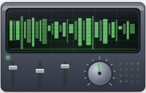
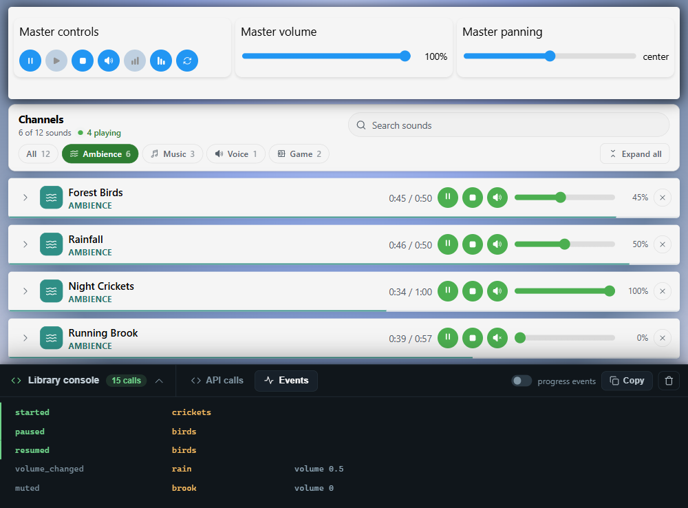
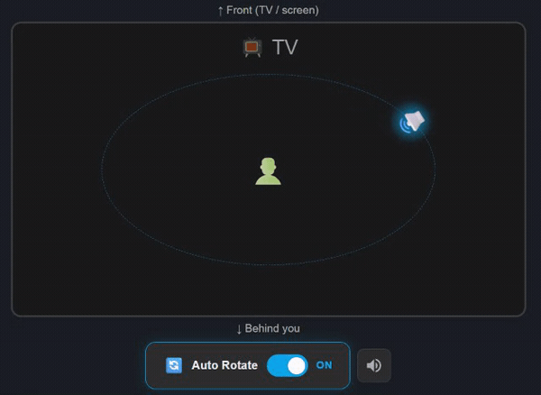

<p align="center">
  
</p>

<h1 align="center">soundhub.js</h1>

<p align="center">
  <strong>One hub for all the audio in your app.</strong><br>
  Load a sound once and address it by id. Every sound reports to the same typed event bus.
</p>

<p align="center">
  <a href="https://www.npmjs.com/package/soundhub"></a>
  <a href="https://www.npmjs.com/package/soundhub"></a>
  <a href="https://www.npmjs.com/package/soundhub"></a>
  <a href="https://www.npmjs.com/package/sound-manager-ts"></a>
  <br>
  <a href="https://bundlephobia.com/package/soundhub"></a>
  <a href="https://www.npmjs.com/package/soundhub?activeTab=dependencies"></a>
  <a href="https://www.npmjs.com/package/soundhub"></a>
  <a href="./LICENSE"></a>
</p>

<p align="center">
  <a href="https://soundhub.chriscreativecode.com/"><strong>Live demo</strong></a> ·
  <a href="https://soundhub-docs.chriscreativecode.com/"><strong>Documentation</strong></a> ·
  <a href="./CHANGELOG.md"><strong>Changelog</strong></a> ·
  <a href="https://stackblitz.com/github/chriscreativecode/soundhub"><strong>Open in StackBlitz</strong></a>
</p>

[](https://soundhub.chriscreativecode.com/general/)

*Four sounds playing at once, each at its own volume, one of them muted. Starting,
pausing, resuming, a volume change and the mute all arrive on the same typed bus.
[Try it with the sound on](https://soundhub.chriscreativecode.com/).*

soundhub plays, loops, fades and pans sounds, places them in 3D, cuts sprites and
streams long files. It ducks music under a voice, varies repeated sounds, and
ships interface sounds that need no files. Coming from Howler.js, one changed
import runs your code on it. It also keeps track of every sound for you, which is the part
most projects end up writing by hand. [What soundhub is built for](#what-soundhub-is-built-for)
shows how, next to a comparison with Howler.js.

Built directly on the Web Audio API. 23 KB gzipped, zero dependencies, typed for
every TypeScript setup and usable from plain JavaScript.

```bash
npm install soundhub
```

My first sound engine was in ActionScript 3.0, back when Flash was still the way to
build games and interactive sites for the browser. This one went on npm on 19
December 2024 as `sound-manager-ts`. Over the next twenty months it had more than
fifty releases and over 8,000 downloads. In August 2026 it became soundhub. Version
6.0.0 is the same code under the new name, plus a few small fixes, and code written
for `sound-manager-ts` still compiles (see [migrating](#from-sound-manager-ts)). The
old package is deprecated on npm and points here. Every commit since the first
release is in this repository, and the [changelog](./CHANGELOG.md) goes back to 1.0.0.

## Quick start

```ts
import { SoundHub, SoundEventsEnum } from 'soundhub';

const hub = new SoundHub({ masterLimiter: true });

await hub.loadSounds([
  { id: 'music', url: '/audio/theme.mp3' },
  { id: 'laser', url: '/audio/laser.wav' },
]);

hub.play('music', { loop: true, volume: 0.6, fadeInDuration: 2 });

// Overlapping one-shots: each call gets its own instance.
hub.play('laser', { overlap: true });

// One bus, one place to react.
hub.addEventListener(SoundEventsEnum.PROGRESS, (event) => {
  progressBar.value = event.state!.progress;
});
```

## What soundhub is built for

You address every sound by id and one hub holds the graph behind it, so the state
of your audio sits in one place instead of spread over your components.

- One typed event bus with 40 event types. A filter per listener narrows it down
  to a single sound, one overlapping instance, or every instance that matches a
  naming pattern.
- The progress event carries the whole state. `event.state` is the same
  `SoundStateInfo` object that `getSoundState()` returns: progress, currentTime,
  duration, playbackRate, volume, pan, spatial position and the playback state. A
  seek bar reads it straight off the event instead of polling for it.
- Long files stay in the graph. `loadStream` plays an hour of audio without
  decoding it first, and it still runs through the panner and the gain nodes, so
  an ambience track gets the same effects and the same 3D position as a sample of
  half a second.
- Ceilings instead of your own bookkeeping. `createSoundGroup` with
  `maxInstances` caps a group, and `maxInstancesPerSound` does the same for every
  sound in the hub without needing a group for it. Hit the cap and the oldest
  instance stops. A master limiter is one config flag, gapless looping is one
  play option, and the lock screen controls are one call to `setMediaSession`.

```ts
hub.addEventListener(SoundEventsEnum.PROGRESS, (event) => {
  const { progress, currentTime, duration } = event.state!;
  seekBar.value = progress;
  timeLabel.textContent = `${format(currentTime)} / ${format(duration)}`;
}, { soundId: 'music' });
```

| | soundhub | Howler.js 2.2.4 |
| --- | --- | --- |
| Events | one typed bus, 40 types, filter per listener | callbacks per `Howl` |
| Progress | the full state on the event, plus `getSoundState` | poll `seek()` yourself |
| Long files | `loadStream`, still in the Web Audio graph | `html5: true`, outside it |
| Spatial on long files | yes | no, HTML5 mode skips the panner |
| Groups | `createSoundGroup` with `maxInstances` | no cap on concurrent instances (`pool` recycles finished ones) |
| Limiter | `masterLimiter: true` | build it yourself on `Howler.ctx` |
| Ducking | `duck('music', { when: 'voice' })` | fade by hand in `onplay` and `onend` |
| Variations | `createVariations` with a pitch and volume spread | pick a random sprite yourself |
| Sounds without files | `soundhub/ui`, and `addBuffer` for your own | needs a url |

Already on Howler? Change the import to `soundhub/howler` and your Howl code
runs on soundhub. `Howler.hub` then gives you everything in the table above.
See [From Howler.js](#from-howlerjs).

soundhub is for apps that run a lot of audio at once. A game, a player, anything
where the music and the one-shots have to stay under control from one place.

## Playing a sound many times at once

By default a sound has one voice. Play it again while it is still running and it
starts over from the top, which is what you want for music and for a voice-over.

For footsteps, lasers, coins and UI clicks you want the opposite. Set `overlap`
and every call gets its own instance, so the sounds stack instead of cutting each
other off:

```ts
hub.play('laser');                     // restarts, one laser at a time
hub.play('laser', { overlap: true });  // stacks, ten lasers if you click ten times
```

Each instance gets its own id, `laser:1`, `laser:2` and so on. `play()` returns
the instance, so you can address a single one:

```ts
const shot = hub.play('laser', { overlap: true });
hub.setSoundVolume(shot!.id, 0.4);
hub.stop(shot!.id);
```

Instances clean themselves up when they end. To put a ceiling on how many can run
at the same time, play them into a group:

```ts
hub.createSoundGroup('lasers', { maxInstances: 8 });
hub.play('laser', { overlap: true, groupId: 'lasers' });
```

The ninth laser stops the oldest one instead of piling up. Without a group,
`new SoundHub({ maxInstancesPerSound: 8 })` does the same for every sound at
once, which is a cheap guard against a stuck key.

On the event bus, the filter tells the two apart. `{ soundId: 'laser' }` matches
that one id, `{ originalId: 'laser' }` matches every instance of it:

```ts
hub.addEventListener(SoundEventsEnum.ENDED, (event) => {
  console.log('finished:', event.soundId);   // laser:3
}, { originalId: 'laser' });
```

You can switch the default over for the whole hub with `new SoundHub({ overlap:
true })`. It stays off unless you ask for it, because overlapping playback changes
what `stop(id)` and `pause(id)` reach: those act on the original id, and the
running instances have their own.

> `overlap` used to be called `createNewInstance`. The old name still works and
> is removed in v7. See [migrating](#migrating).

## Sprites

One file, many sounds. Load the sprite sheet, name the ranges in seconds, then
play them by name:

```ts
await hub.loadSound('ui', '/audio/ui-sprites.mp3');

hub.setSoundSprite('ui', {
  click: [0, 0.2],      // [start, end] in seconds
  hover: [0.5, 0.7],
  error: [1, 1.8],
});

hub.playSprite('ui', 'click');
hub.playSprite('ui', 'error', { volume: 0.8 });
```

`setSoundSprite` cuts each range into its own buffer once, so playing a sprite is
as cheap as playing any other sound and it starts exactly on the sample you asked
for. The two go together well: `hub.playSprite('ui', 'click', { overlap: true })`
lets a fast typist trigger the same click twenty times without it stuttering.

Sprites need the samples in memory, so they work on sounds loaded with
`loadSound` and not on streams.

## Ducking

Music that drops when someone speaks, and comes back when they stop. Every game
with dialogue and every video app with a voice-over needs it, and it is usually
a pile of fades wired to callbacks. Here it is one line:

```ts
hub.duck('music', { when: 'voice', amount: 0.3 });

hub.play('music', { loop: true });
hub.play('voice');   // the music drops to 30% in 50 ms
                     // and comes back over half a second when the voice ends
```

`when` takes one name or a list, and a name can be a sound, a group or a
stream. With `{ when: 'dialogue' }` and a group called `dialogue`, every line
in the group ducks the music, and it stays down until the last one has
finished. Overlapping instances count too, so three barks from a dog keep the
music down until the third one ends. A paused or muted trigger does not duck.

```ts
hub.createSoundGroup('dialogue');
hub.duck(['music', 'ambience'], {
  when: 'dialogue',
  amount: 0.25,     // the level it drops to
  attack: 0.1,      // seconds to go down
  release: 0.8,     // seconds to come back up
});

hub.play('line-12', { groupId: 'dialogue' });
```

The duck has its own gain node between the target and the master bus. It
never touches the target's volume, so a `setSoundVolume` or a fade during a
duck is still there after it. `duck_started` and `duck_ended` arrive on the
event bus for a subtitle or a meter, `isDucked('music')` tells you where it
stands, and `duck()` hands back a function that removes the duck again.

## Variations

The same footstep a hundred times in a row sounds like a machine. Record three
or four takes, give them one name, and `play` picks one:

```ts
await hub.loadSounds([
  { id: 'step1', url: '/audio/step1.mp3' },
  { id: 'step2', url: '/audio/step2.mp3' },
  { id: 'step3', url: '/audio/step3.mp3' },
]);

hub.createVariations('footstep', ['step1', 'step2', 'step3'], {
  pitch: [0.95, 1.05],   // a slightly different playback rate each time
  volume: [0.8, 1],      // and a slightly different level
});

hub.play('footstep');    // never the same take twice in a row
```

`order: 'shuffle'` plays every take once before any repeats, and `'cycle'` plays
them in the order given. The takes overlap each other by default, `stop('footstep')`
stops every take it started, and the name works in `duck()` as well. A take can
be a sprite, `'ui_click'` for the sprite `click` of `ui`, so one file can hold
all of them.

## Interface sounds without files

`soundhub/ui` renders twelve interface sounds in the browser: click, tap, toggle
on and off, success, error, warning, notify, pop, swipe, delete and a key press.
Nothing is fetched, there are no files to host and no licence to check, and the
whole set is 1.5 KB gzipped.

```ts
import { SoundHub } from 'soundhub';
import { addUiSounds, uiSounds } from 'soundhub/ui';

const hub = new SoundHub();
addUiSounds(hub, { volume: 0.5 });

saveButton.onclick = () => hub.play(uiSounds.success);
input.onkeydown = () => hub.play(uiSounds.type);
```

After `addUiSounds` they are ordinary sounds in the hub, with the ids
`ui.click`, `ui.success` and so on. `groupId: 'interface'` puts them in a group,
so `hub.getGroup('interface').sounds` reaches all of them at once. `only` takes
a subset and `prefix` changes the ids. They overlap by
default, so a fast typist does not cut the previous key off.

The same route is open to your own audio: `hub.addBuffer(id, buffer)` turns any
`AudioBuffer` you synthesised, recorded or decoded yourself into a sound.

## Loading

Give a sound a list of urls and the browser picks the one it can play. The check
runs before anything is fetched, so the files it cannot use are never requested:

```ts
await hub.loadSound('theme', [
  '/audio/theme.opus',   // Chrome, Firefox, Edge
  '/audio/theme.m4a',    // Safari
]);

SoundHub.canPlay('opus');        // false on older Safari
SoundHub.getSupportedFormats();  // ['mp3', 'wav', 'm4a', ...]
```

A url without a known extension, a signed CDN link for example, is used as is.
soundhub would rather try and fail than refuse to load anything.

Sounds you do not need at startup can be written down and fetched later:

```ts
hub.registerSounds([
  { id: 'boss-music', url: ['/audio/boss.opus', '/audio/boss.mp3'] },
  { id: 'victory', url: '/audio/victory.mp3' },
]);

hub.getLoadState('boss-music');    // 'unloaded'

await hub.loadSound('boss-music'); // no url needed, it is on file
hub.getLoadState('boss-music');    // 'loading', then 'loaded' or 'error'
```

`loading` events fire on the same bus, so a spinner is four lines. For audio
behind a token, `fetchHeaders` goes on every request:

```ts
const hub = new SoundHub({
  fetchHeaders: { Authorization: `Bearer ${token}` },
});
```

## A closer look

"What soundhub is built for" is the short version. This is the same ground with
the code on it, plus the parts that did not fit there.

**Filters and unsubscribing.** A listener can be narrowed to one sound, one
overlapping instance, or every instance matching a pattern, and
`addEventListener` hands back the function that removes it again:

```ts
const off = hub.addEventListener(SoundEventsEnum.PROGRESS, (event) => {
  bar.value = event.state!.progress;             // no id check needed
}, { soundId: 'music' });

hub.once(SoundEventsEnum.ENDED, playNextTrack, { soundId: 'music' });

off();  // addEventListener hands back its own unsubscribe
```

**What a group carries.** A group has its own play options, so
`play(id, { groupId })` inherits looping, volume and the rest from the group
instead of repeating them per call. The master limiter is off by default:
turning it on is a deliberate change to how your project sounds.

[](https://soundhub.chriscreativecode.com/spatial/)

*One sound orbiting the listener, with the panner settings live. This is one feature
of several, not what the library is for.*

**A listener you can move.** `setSpatialPosition` moves a sound around the ear,
which is what a map or a menu needs. A first-person camera works the other way
round: the sounds stay where they are and you move. `setListenerPosition` and
`setListenerOrientation` do that, and `setSpatialOrientation` points a sound in
a direction, which is what makes the cone settings on the panner mean something.

```ts
hub.setListenerPosition(player.x, 0, player.z);
hub.setListenerOrientation(camera.x, 0, camera.z);

hub.setSpatialOrientation('television', 0, 0, -1);   // facing into the room
```

**Sleeping on battery.** A running audio context keeps the audio hardware awake
even when nothing plays. With `autoSuspend: true` the context goes to sleep after
thirty seconds of silence and the next `play()` wakes it. Off by default, because
waking up costs a few milliseconds and a game that fires sounds constantly is
better off awake.

**An escape hatch.** `getMasterInput()` and `getMasterOutput()` let you route your
own oscillators through the master chain, or hang an `AnalyserNode` off the output
for a visualiser. The library never gets in your way.

Also included: seamless looping, fades per sound and globally, playback rate,
stereo panning, 3D spatial positioning with HRTF, cross-origin loading with
retries, and mobile handling (auto-unlock, auto-mute when the tab hides,
auto-resume on focus).

**Why a stream is a different thing.** Short sounds are decoded into memory,
which is what makes precise scheduling, sprites and instance stacking possible.
An hour-long podcast loaded that way would cost hundreds of megabytes and a long
wait before the first sound. So `loadStream` takes the other route: the browser
fetches as it plays.

```ts
await hub.loadStream('episode-42', '/audio/episode-42.mp3');

hub.play('episode-42');
hub.setPlaybackRate('episode-42', 1.5);   // podcast listeners want this
hub.seek('episode-42', 1800);             // jump half an hour in
```

Playback, seeking, volume, fades, mute, panning, playback rate, looping, state and
progress events behave the same as for a buffered sound, on the same event bus.
What a stream cannot do is anything that needs random access to samples: sprites
and `overlap` are unavailable, and looping is handled by the browser, so no
`loop_completed` event fires. `getStreamElement(id)` hands you the media element
for the rest, such as buffered ranges for a loading bar.

**The lock screen works.** `setMediaSession` puts a title, artist and artwork on
the operating system's media controls and wires up the hardware keys for play,
pause, skip back fifteen, skip forward thirty, and the scrubber:

```ts
hub.setMediaSession('episode-42', {
  title: 'Episode 42: naming things',
  artist: 'The Podcast',
  artwork: [{ src: '/cover-512.png', sizes: '512x512', type: 'image/png' }],
  onNextTrack: () => playEpisode(43),
});
```

soundhub keeps the playback state and the scrubber position in step as the
sound plays; `clearMediaSession()` takes it off again.

## Examples

The `examples/` folder holds a single page that exercises the whole public API:
sprites, overlapping instances, deferred loading, progress and seeking, groups,
fades, mute, panning, spatial audio with a listener you can move, streaming, a
level meter on the master output, and a live view of the event bus. Each card
prints the soundhub calls behind your last click.

```bash
npm install
npm run dev
```

Every sound in `examples/sounds/` is synthesised by
`scripts/generate-example-sounds.py`. Nothing there is sampled or downloaded, so
the example audio carries the same MIT licence as the rest of the project.

## Tests

```bash
npm test              # once
npm run test:watch    # while you work
npm run test:coverage
```

Vitest on jsdom, with a Web Audio mock in `tests/support`. The mock is a plain
stand-in: nodes remember what they are connected to, audio params remember their
value, the clock only moves when a test moves it, and a buffer source refuses a
second `start()` the way the real one does. That is enough to run the library
itself rather than a rehearsal of it, so the tests cover loading, playback,
overlap, sprites, groups, fades, panning, spatial audio, the listener, streams,
the media session, ducking, variations, the interface sounds, the Howler layer
and the event bus.

## API

Full reference: **[soundhub-docs.chriscreativecode.com](https://soundhub-docs.chriscreativecode.com/)**

The shape of it:

| Area | Methods |
| --- | --- |
| Loading | `loadSound` `loadSounds` `addBuffer` `registerSound` `registerSounds` `loadStream` `updateSoundUrl` `unloadSound` `removeSound` `isSoundLoaded` `getLoadState` `getSoundUrls` `canPlay` `getSupportedFormats` |
| Playback | `play` `playSprite` `pause` `resume` `stop` `seek` `stopAllSounds` `pauseAllSounds` `resumeAllSounds` |
| Volume & mute | `setSoundVolume` `setGlobalVolume` `mute` `unmute` `toggleGlobalMute` `fadeIn` `fadeOut` `fadeGlobalIn` `fadeGlobalOut` |
| State | `getSoundState` `isPlaying` `isPaused` `getProgress` `getDuration` `startProgressTracking` |
| Groups | `createSoundGroup` `addToSoundGroup` `removeFromSoundGroup` `getGroup` `removeSoundGroup` |
| Ducking | `duck` `unduck` `isDucked` `getDuckLevel` |
| Variations | `createVariations` `removeVariations` `getVariations` |
| Sprites | `setSoundSprite` `getSpriteConfig` `removeSpriteConfig` |
| Panning | `setPan` `setGlobalPan` `resetPan` `isStereoPanActive` |
| Spatial | `setSpatialPosition` `setSpatialOrientation` `setMasterSpatialPosition` `setMasterSpatialOrientation` `updatePannerConfigById` `removeSpatialEffect` |
| Listener | `setListenerPosition` `setListenerOrientation` `getListenerPosition` `getListenerOrientation` `resetListener` |
| Streaming | `loadStream` `isStream` `getStreamElement` |
| Graph | `getContext` `getMasterInput` `getMasterOutput` `setMasterLimiter` `getMasterLimiterNode` `suspendContext` `resumeContext` |
| Events | `addEventListener` `once` `removeEventListener` `dispatchEvent` `hasEventListener` |
| Media Session | `setMediaSession` `clearMediaSession` |
| `soundhub/ui` | `addUiSounds` `uiSounds` `renderUiSound` |
| `soundhub/howler` | `Howl` `Howler` |

## Browser support

Every current browser: Chrome, Edge, Firefox and Safari, desktop and mobile.

## Migrating

### From createNewInstance to overlap

`createNewInstance` is now called `overlap`. It does the same thing, the default
is still off, and the old name keeps working until v7. Both the play options and
the hub config accept either, and `overlap` wins if you pass both.

```diff
-hub.play('laser', { createNewInstance: true });
+hub.play('laser', { overlap: true });
```

Nothing breaks if you change nothing. Your editor will mark the old name as
deprecated, which is the reminder.

### From Howler.js

`soundhub/howler` has the Howler API on top of soundhub. Change the import and
the code you have keeps running:

```diff
-import { Howl, Howler } from 'howler';
+import { Howl, Howler } from 'soundhub/howler';

 const sfx = new Howl({
   src: ['/audio/sfx.webm', '/audio/sfx.mp3'],
   sprite: { laser: [0, 400], coin: [500, 300] },
   onend: (id) => console.log('done', id),
 });
 const id = sfx.play('laser');
 sfx.volume(0.5, id);
```

It covers the Howl options projects use (`src`, `volume`, `loop`, `rate`,
`mute`, `sprite`, `autoplay`, `preload`, `html5` and the `on*` callbacks), the
methods `play`, `pause`, `stop`, `mute`, `volume`, `fade`, `rate`, `seek`,
`loop`, `playing`, `duration`, `state`, `stereo`, `pos`, `load`, `unload`, `on`,
`once` and `off`, and `Howler.volume`, `mute`, `stop`, `unload`, `codecs` and
`ctx`. Units are Howler's: milliseconds for sprites and fades, seconds for
`seek` and `duration`.

Not covered: the Howl options `format`, `pool` and `xhr`, `orientation` and the
per-Howl panner settings, and on `Howler` the properties `autoSuspend`,
`autoUnlock`, `html5PoolSize`, `usingWebAudio` and `noAudio`. A volume, rate or
mute set on one voice before its file has loaded is not queued the way Howler
queues it. Use the hub for the rest.

Every Howl plays through one shared SoundHub, and `Howler.hub` hands it to you,
so you can move over one feature at a time. `howl.soundhubId` is the id of that
Howl in the hub:

```ts
Howler.configure({ masterLimiter: true });   // before anything else on Howler

const music = new Howl({ src: '/audio/music.mp3', loop: true });
const voice = new Howl({ src: '/audio/voice.mp3' });

Howler.hub.duck(music.soundhubId, { when: voice.soundhubId });
```

### From sound-manager-ts

soundhub is the continuation of `sound-manager-ts`. The API is unchanged; the
package and the main class were renamed.

```diff
-import { SoundManager } from 'sound-manager-ts';
-const manager = new SoundManager();
+import { SoundHub } from 'soundhub';
+const hub = new SoundHub();
```

`SoundManager` and `SoundManagerConfig` are still exported as deprecated aliases,
so existing code compiles unchanged. They will be removed in v7.

## Contributing

Issues and pull requests are welcome. If you hit an edge case, a reproduction in
the examples page is the fastest way to get it fixed.

## Licence

MIT © [Chris Schardijn](https://www.chriscreativecode.com)
